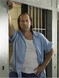

html lang="en">
<head>
    <meta charset="UTF-8">
    <title>Prison Break Wiki</title>
    
</head>
<body>

    

        <h1>Welcome to the Prison Break Wiki</h1>
        
Prison Break is an American television serial drama created by Paul T. Scheuring. Seasons 1 through 4 were broadcast on FOX from 2005 to 2009. Season 5 aired from April to May 2017. While Season 6 was confirmed in January 2018, FOX decided not to move forward as of August 2019, and Wentworth Miller said he was no longer interested in participating in the show in 2020.

        
As of 2023, a new chapter of Prison Break is in-development at Hulu. Prison Breaking with Sarah and Paul, a rewatch podcast, launched in January 2024.

        
Michael Scofield is a desperate man in a desperate situation. His brother, Lincoln Burrows, was convicted of a crime he didn't commit and put on death row. Michael holds up a bank to get himself incarcerated alongside his brother in Fox River State Penitentiary, then sets in motion a series of elaborate plans to break Lincoln out and prove his innocence. Once out of jail, their perils aren't over -- the brothers must flee to escape recapture and battle an intricate political conspiracy that endangers everyone's life.

    

    <h2>Characters</h2>
    

        

            
            
Michael Scofield

        

        

            
            
Lincoln Burrows

        

        

            
            
Alexander Mahone

        

        

            
            
Sara Tancredi-Scofield

        

        

            
            
Theodore Bagwell

        

        

            
            
Gretchen Morgan

        

        

            
            
Fernando Sucre

        

        

            
            
John Abruzzi

        

        

            
            
Brad Bellick
           
